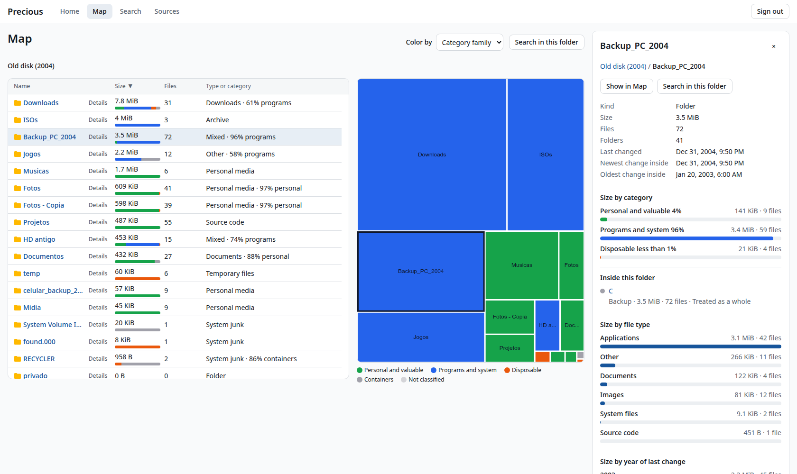
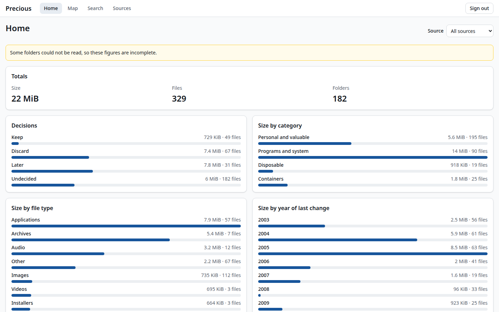
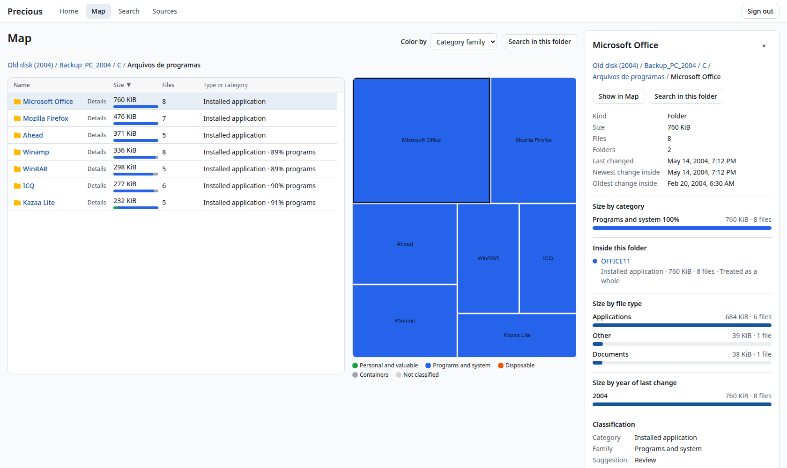
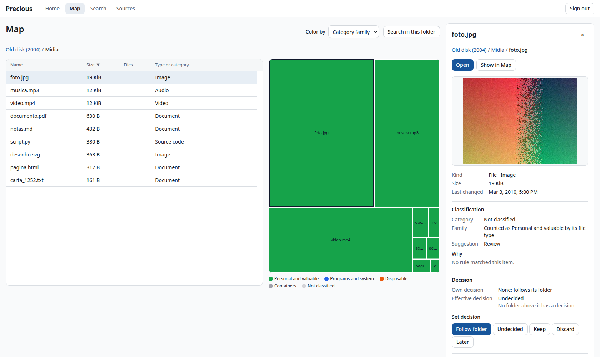
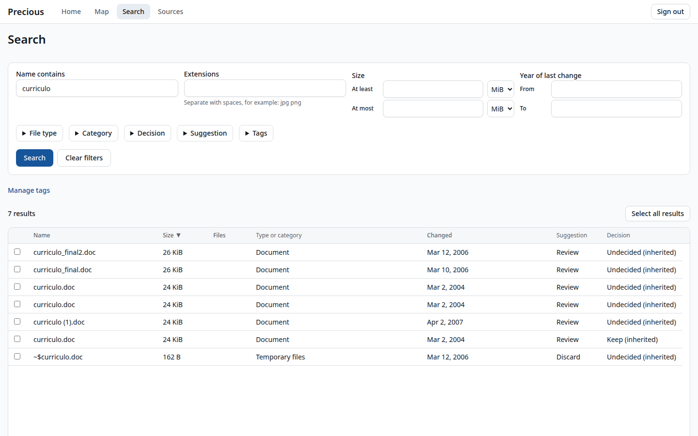
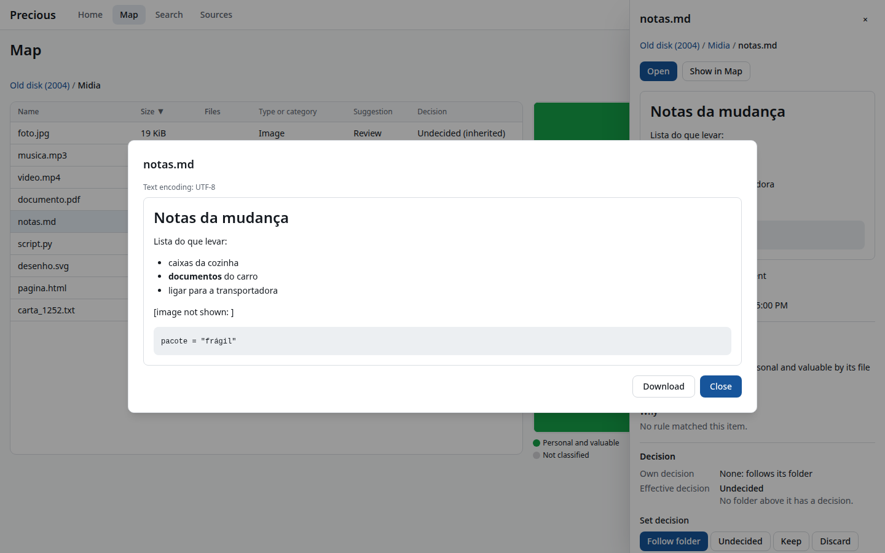
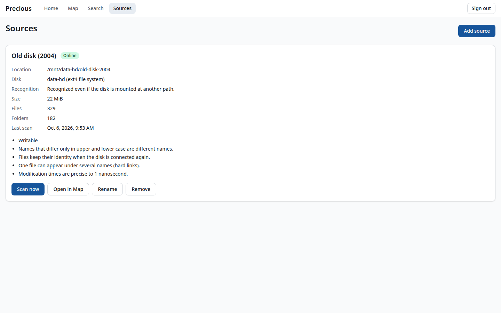

# Precious

**Make sense of a disk that has been collecting files for twenty years.**


-555)

[](LICENSE)

Precious is a self-hosted web application for the owner of an old, messy archive: copied `Program Files` and `WINDOWS` trees, photo folders copied three times over, zip files sitting next to their unpacked copies, installers from 2005, and somewhere in there the files that actually matter.

It indexes every file and folder on the disks you add and shows where the space goes. You can find any file, see what each folder is made of, look at files safely, and record what to keep and what to discard. It **never writes to your disks**. It is one binary you run on your file server or your own computer, reached from a browser on your local network, with no cloud service involved.



## What it answers

Precious is built around a handful of questions:

1. **Where is my space going,** by folder, by kind of file, and by year?
2. **What is obviously disposable,** and how much space does it hold?
3. **What is personal or valuable,** and where is it hiding?
4. **What is duplicated,** and which copy should I keep?
5. **What have I decided so far,** and what is left?

## Features

- **Every folder has a size.** A full metadata index of every entry, with the total bytes and file count of every folder, broken down by file type, by year, and by category.
- **See what a folder is made of.** Each folder shows its composition: for example, 98% personal media and 2% programs. It also lists what is notable inside it: installed programs, downloads, caches, or drive backups buried among the photos. From the top folder you get clues straight away, without opening folder after folder.
- **A Map of your space.** A treemap and a sortable table of the same folder, side by side and in sync, colored by category, file type, age, decision, tag, or how much of each folder is duplicated.
- **Classification you can read.** Rules sort every file and folder into 16 categories in four families (personal and valuable, programs and system, disposable, containers), with a keep, discard, or review suggestion. Every classification comes with a one-sentence explanation. A folder that would be discarded is held back for review when it holds your own documents, photos, saved games, or mail, and the panel names the files that held it back.
- **Find anything.** Search by name, extension, file type, size, year, category, suggestion, decision, tag, folder, or whether a file has a copy, anywhere in the index, including inside installed programs and copied drives.
- **Find every copy.** Precious reads file content in the background and finds copies by their SHA-256, never by name: duplicate files, folders that hold the same files under other names, and zip or tar archives next to their unpacked folders. It only reads files that could have a copy, never reads an unchanged file twice, and always says how much of the content it has checked, so "no other copy" is never a guess.
- **Compare two folders.** Side by side: what is only on the left, only on the right, identical, or the same name with different content, such as the one edited photo that exists only in the copy.
- **What to look at first, and what is valuable.** Opportunity cards (duplicate folders and files, archives already unpacked, system junk, old installers, program copies, caches, leftovers) open review lists you can work through with the keyboard. Gems lists your personal photos and documents with no other copy, and your own files buried inside programs.
- **Inside archives.** Browse zip and tar archives in the Map and open their photos and documents in the viewer, read in memory without unpacking anything to disk.
- **Look without risk.** Preview photos, video, audio, PDF, text, source code, and Markdown right in the detail panel. File types come from Precious's own table, never from the content. HTML and SVG from your disk never run, and Markdown is sanitized with no remote content.
- **Decide, safely.** Mark folders and files keep, discard, or later; a decision on a folder applies to everything inside it. Bulk decisions never override something you kept, and they report exactly what they skipped. Free-form tags are inherited the same way. Duplicates never decide anything for you: each copy is yours to decide.
- **Read-only by design.** Scanning, hashing, archive reading, classification, and previews never write to a source; tests prove it on a read-only mount. Changing files on disk is a later, explicit, reversible step (see the [roadmap](#status-and-roadmap)).
- **Disks that come and go.** Each source is recognized by its volume identity (filesystem UUID, ZFS dataset, or Btrfs filesystem ID), not its path. A USB disk mounted somewhere else is the same source, and an unplugged disk stays browsable and searchable.
- **Self-contained and private.** One static Go binary with the web interface built in. It needs no runtime dependencies, makes no outbound connections, and loads nothing from the internet. Access is protected by a password, server-side sessions, CSRF checks, and a strict Content-Security-Policy.
- **Fast on large archives.** In the R1 measurement on a 4-core Celeron J4125 home server with four hard disks in RAIDZ1, a first scan of 1.49 million entries (about 780 GiB) took 3.5 minutes from a cold cache, 1.23 times a bare metadata walk of the same tree. On a benchmark index of 2 million entries, Map pages answer in under 10 ms at the 95th percentile.

## Screenshots

<table>
  <tr>
    <td width="50%"><br><sub><b>Home:</b> totals, decision progress, and where the bytes are.</sub></td>
    <td width="50%"><br><sub><b>Classification:</b> each installed program is its own item to review.</sub></td>
  </tr>
  <tr>
    <td width="50%"><br><sub><b>Preview:</b> files show in the detail panel without opening anything.</sub></td>
    <td width="50%"><br><sub><b>Search:</b> every copy of <code>curriculo.doc</code>, wherever it hides.</sub></td>
  </tr>
  <tr>
    <td width="50%"><br><sub><b>Viewer:</b> Markdown rendered without scripts or remote content.</sub></td>
    <td width="50%"><br><sub><b>Sources:</b> added from a folder picker, recognized by their volume.</sub></td>
  </tr>
</table>

The screenshots show the built-in regression corpus, a generated copy of a typical 2000s Windows backup disk (`go run ./tools/gencorpus`).

## Status and roadmap

Precious is in **early development**. Milestones R1 and R2 are complete: each was accepted by its first user on a real 780 GiB archive, on 2026-10-06. There are no tagged releases yet, and things may change incompatibly until 1.0.

| Milestone | Scope | Status |
|---|---|---|
| **R1** Full index and explorer | Scanning and rescans, folder sizes and composition, classification rules, Home, Map, Search, detail panel, viewer, decisions and tags, sources with volume identity | ✅ Done |
| **R2** Duplicates and gems | Content hashing, duplicate files and folders, a zip against its unpacked folder and browsing inside archives, folder comparison with the files unique to each side, opportunities, files with no other copy | ✅ Done |
| **R3** Organizing | Moves and renames with undo, through one journaled, no-overwrite executor | Planned |
| **R4** Cleanup | Cleanup plans, a reversible quarantine, a pre-delete check that every file has a verified copy, and purge | Planned |
| **R5** Media dates | Photo and video dates from metadata, corrections, and organizing by date | Planned |
| **R6** Classifier assistant | An optional model that suggests categories where the rules are unsure; it never decides | Planned |
| **R7** Versions and extended viewer | Families of file versions, thumbnails, conversions through optional tools, Brazilian Portuguese | Planned |
| **R8** macOS, Windows, and removable media | Native backends, optical media, and their acceptance tests | Planned |

**Platforms.** Linux (amd64 and arm64) is complete and tested. The same binary builds for macOS and Windows and runs there with a portable backend: volume identity is weaker, and filesystem capabilities are assumed conservatively until R8.

The full product specification is [`precious-spec-v0.3.md`](precious-spec-v0.3.md), and the reasons behind the current design are in [ADR 0008](docs/adr/0008-product-reset.md).

## Getting started

### Build

You need Go (`go.mod` pins go1.27.1, which Go downloads automatically) and Node.js LTS with npm to build the web interface:

```sh
git clone https://github.com/ddsimoes/precious.git
cd precious
make build          # builds the web interface, then bin/precious
```

`make cross` builds `bin/precious-<os>-<arch>` for Linux, macOS, and Windows on amd64 and arm64.

### Configure

Create a configuration file, `precious.toml`:

```toml
state_dir = "/home/me/precious-state"    # Precious's own database: an absolute path on local storage

[server]
listen = "127.0.0.1:8080"
external_origin = "http://127.0.0.1:8080"
allow_insecure_http = true               # plain HTTP is fine on loopback or a trusted LAN

[sources]
allowed_roots = ["/mnt", "/media"]       # where sources may be added from
```

To use it from other machines on your network, listen on `0.0.0.0:8080`, set `allow_non_loopback_listen = true`, and set `external_origin` to the address browsers use. [`deploy/examples/precious.toml`](deploy/examples/precious.toml) lists every setting with its default.

### Run

```sh
bin/precious check-config --config precious.toml        # validate and print the effective settings
bin/precious admin set-password --config precious.toml  # interactive; there is no default password
bin/precious serve --config precious.toml
```

Open the `external_origin` in a browser and sign in. On the **Sources** screen, add a folder or a whole disk through the folder picker and choose **Scan now**. Then explore it from **Home** and the **Map**.

For production use, the [operator guide](docs/operator.md) covers [systemd](docs/operator.md#systemd) (a hardened unit is in [`deploy/precious.service`](deploy/precious.service)), a [container image](docs/operator.md#container-image) and [Compose](docs/operator.md#compose) setup, [read-only disk mounts](docs/operator.md#read-only-disk-mounts-recommended), [backups](docs/operator.md#backup-and-restore), and the full [configuration reference](docs/operator.md#configuration-reference).

## Development

```sh
make test        # Go tests with the race detector, and the web interface tests (Vitest)
make test-slow   # adds the slow tests, such as the 2-million-entry Map benchmark
make e2e         # Playwright: a real server over the regression corpus, driven in Chromium
make e2e-docker  # tests that need real mounts, as root in privileged Docker
make ui          # rebuild the web interface into web/dist
```

`go build ./...` and `go test ./...` work without Node.js; a binary built without the interface serves a page saying how to build it.

| Path | Contents |
|---|---|
| `cmd/precious` | The binary: `serve`, `check-config`, `admin set-password`, `backup`, `version` |
| `internal/index` | The scanner: one pass that records every entry with folder totals, composition, and classification |
| `internal/fsaccess` | Read-only, rooted filesystem access: no symlink following, no mount crossing, byte-exact names |
| `internal/rules`, `policies/` | Classification rules and name markers |
| `internal/sources` | Sources, volume identity, the folder picker |
| `internal/search`, `internal/web/api`, `internal/viewer` | Search, the read API, and the safe viewer |
| `internal/decisions` | Decisions, tags, and selections |
| `web/ui` | The React and TypeScript interface (Vite, Tailwind, TanStack, ECharts) |
| `internal/corpus`, `tools/` | The regression corpus generator and the scan benchmark |
| `openspec/` | Change proposals, designs, and requirement specs |

## License

Copyright © 2026 Daniel Simoes.

Precious is free software: you can redistribute it and/or modify it under the terms of the [GNU Affero General Public License](LICENSE) as published by the Free Software Foundation, either version 3 of the License, or (at your option) any later version.

Precious is distributed in the hope that it will be useful, but WITHOUT ANY WARRANTY; without even the implied warranty of MERCHANTABILITY or FITNESS FOR A PARTICULAR PURPOSE. See the GNU Affero General Public License for more details.

In short: you may use, modify, and self-host Precious freely. If you modify it and let others use it over a network, you must offer them the source code of your modified version under the same license.
